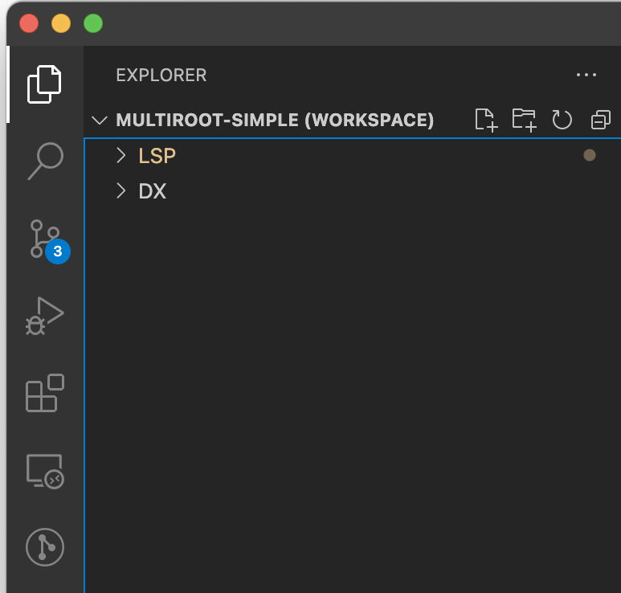
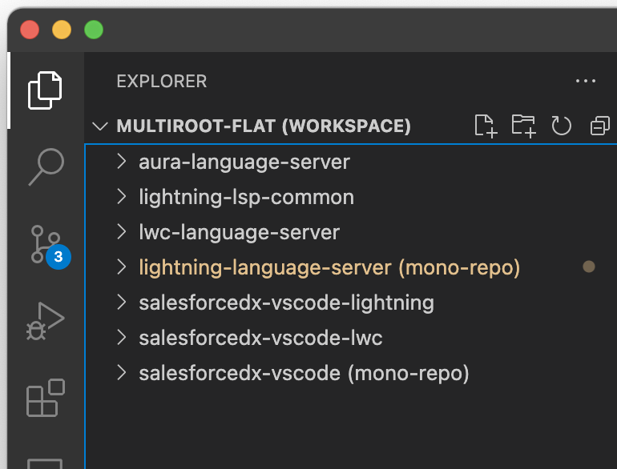

[](https://opensource.org/licenses/BSD-3-Clause)<br/>
[](https://www.npmjs.com/package/@salesforce/lwc-language-server)
[](https://www.npmjs.com/package/@salesforce/aura-language-server)
[](https://www.npmjs.com/package/@salesforce/lightning-lsp-common)
[](http://commitizen.github.io/cz-cli/)

# Lightning Language Servers

Mono repo for the LWC and Aura Language Services that are used in the [Salesforce Extensions for VS Code](https://github.com/forcedotcom/salesforcedx-vscode).

### Issues & Features

Open issues and feature requests on the [Salesforce VSCode Extensions Repository](https://github.com/forcedotcom/salesforcedx-vscode/issues/new/choose).

## Setup Development Environment

### Pre-requisites

Follow the pre-requisites here:
https://github.com/forcedotcom/salesforcedx-vscode/blob/develop/CONTRIBUTING.md

### Clone this repository and Salesforce VSCode Extensions

```
git clone git@github.com:forcedotcom/lightning-language-server.git
git clone git@github.com:forcedotcom/salesforcedx-vscode.git
```

Note: These projects need to be cloned into the same parent directory

### Setup lightning-language-server repository

```
cd lightning-language-server
yarn install
yarn link-lsp
```

### Setup Salesforce VSCode Extensions repository

```
cd ../salesforcedx-vscode
npm install
npm run link-lsp
npm run compile
```

### Open both repositories in a vscode workspace

```
cd lightning-language-server
code ./vscode-workspaces/multiroot-simple.code-workspace # or
code ./vscode-workspaces/multiroot-flat.code-workspace
```

The "simple" workspace will effectively show two main nodes in the Explorer, while "flat" will show each package separately.

Simple:



Flat:



### Debugging with VSCode

Run 'Launch DX - Aura & LWC' from the VSCode debug view (its the last one in that long list).

### Recompile on change

```
cd ../lightning-language-server
yarn watch
cd ../salesforcedx-vscode
npm run watch
```

Note: You need to restart vscode each time you make changes to the language server or the lightning vscode extensions.
Easiest way to do this is to kill the vscode client and hit F5 to relaunch your debugger.

## Publishing to NPM
When a commit is merged to main, we will automatically create the github release, and then publish the changes to npm using our Github Actions

### On-Demand publish to NPM
Navigate to the `Actions` tab in the repository
1. Under `Workflows` on the left side, select `Release`.
1. Select `Run Workflow` on the top row.
1. Enter the desired version number, following semantic versioning.
1. Select `Run Workflow`, and ensure the newest version is published to npm once the workflow completes.
1. Any failures will notify the pdt release channel internally.